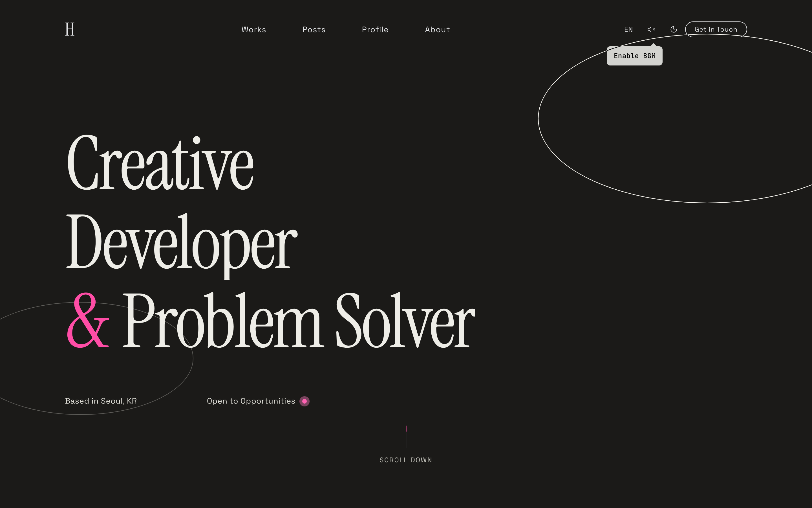

<!-- HEADER -->

  

## 👋 About Me

안녕하세요, 프론트엔드 중심의 풀스택 개발자 **김정현**입니다. Seoul, South Korea 🇰🇷

- **React / Next.js / TypeScript**로 인터랙티브하고 성능 좋은 웹 애플리케이션을 만듭니다.
- Node.js와 Express로 필요한 API를 직접 설계하고, MySQL / Supabase로 데이터를 다룹니다.
- 접근성과 반응형을 기본으로 생각하며, AI API를 프로젝트에 통합하는 일에 관심이 많습니다.

 

## 🚀 Featured Project

### [Arc — 개인 포트폴리오 & 블로그 플랫폼](https://github.com/hyeoniverse/web-portfolio-oval)

Next.js 16 · React 19 · TypeScript · Supabase · GSAP · Framer Motion · Three.js

- **인터랙션**: 무한 스크롤 루프, 마우스 패럴랙스, Three.js 3D 오브젝트, 방향별 Scroll Cascade
- **Works & Blog**: 6종 레이아웃 전환, SSR + ISR, 시리즈, 게스트 댓글 / giscus 전환
- **Admin**: Plate.js 기반 WYSIWYG 에디터, 마크다운 동기화, AI 번역/요약, 리비전 히스토리, GitHub OAuth + 역할 기반 멤버 관리
- **품질**: Lighthouse 98 (LCP 1.9s), RLS + CSRF 가드 등 다층 보안, OKLCH 기반 3-tier 디자인 토큰 시스템

  

 

## 🛠 Tech Stack

  
  
  
  
  
   
  
  
  
  

 

## 📊 GitHub Stats

  
  

 

## 📬 Contact

  &nbsp;
  &nbsp;
  

<!-- FOOTER -->

  

